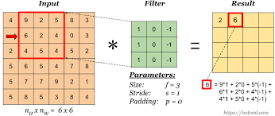

<h2>Cotton Leaves Disease Prediction using CNN 🍃</h2>
<h3>Table of Content</h3>
<ul>
<li><a href='#cnn'>Understanding CNN?</a></li>
<li><a href='#model'>Model creation and Evaluation</a></li>
<li><a href='#prediction'>Prediction</a></li>
<li><a href='#conclusion'>Conclusion</a></li>
</ul>

<h3 id='cnn'>Understanding CNN</h3>

It stands for <i>Convolution Neural Network</i>, and it is the best algorithm when it comes to working with images, basically it takes two major mathematical processes that differentiate it with other Neural Network techniques.

<ol>
<li>Convolution Opration</li>
<li>Pooling Opration</li>
</ol>

1. <b>Convolution Opration</b>: Convolution is a specialized kind of linear operation. Convolution between two functions in mathematics produces a third function expressing how the shape of one function is modified by the other.
<h4>Convolution Kernels</h4>
A kernel is a small 2D matrix whose contents are based upon the operations to be performed. A kernel maps on the input image by simple matrix multiplication and addition, the output obtained is of lower dimensions and therefore easier to work with.

<b>Fig:</b> Convolution opration

In this figure we found that our input matrix is of 6x6 and filter is of size 3x3 with <i>stride</i> = 1 and <i>padding</i> = 0, <b>*</b> represents convolution operation between Input matrix and the filter. This filter is basically used to detect the vertical edge in the image i.e. resultant matrix is basically used to reduced the image width and only take those part which is important.

<h4>Pooling Operation</h4>

Its function is to progressively reduce the spatial size of the representation to reduce the amount of parameters and computation in the network. We uses pooling to recognize an image if the image is tilted or not the same as the previous image.

There are basically 2 types of pooling opraration:
<ol>
<li>Max Pooling</li>
<li>Average Pooling</li>
</ol>

<b>1. Max Pooling:</b>   

<b>Fig:</b> Max pooling Opration 

As the figure indicates if a 2x2 Max pool is used in the network then the  matrix creates a 2x2 window and takes the <i>maximum value among the 4 values</i> in that particular window. It's a very important operation in CNN because it's basically removes those low parameter values and reduces computation.

<b>2. Average pooling:</b> Average pooling is also doing a similar operation but instead of taking the maximum value from the window it calculates the average of the window and then gives the result. Basically today's in general we are using max-pooling as the pooling layer operation because it gives better accuracy and also it's a little faster than the average pooling opratin

With this two operation in CNN we can able to compute 2D inputs such as images very easily.

<h4>Complete CNN architecture</h4>

<b>Fig:</b> CNN Architecture

Let me explain the steps involved in this architecture

<ul>
<li>In the first step an image is passed to Conv layer 1 which is used to do convolution operation</li>
<li>Then pooling layer is created to reduced parameters</li>
<li>Layer 3 and 4 are similar like 1 and 2</li>
<li>In layer 5 which termed as hidden in this image also called flatten on fully connected layer are just a dense layer converted from the last conv layer after this layer only we apply <b>sigmoid or softmax</b> activation funtion to get the output.</li> </ul>
<h3 id='model'>Model Building</h3>

Before moving to build the model let's discuss about the dataset.

So basically our dataset consist of two folders one is for fresh cotton leaves and another one is diseased leaves. We used Keras flow_from_directory method to extract the dataset

Next let's see the images and understand the how to deal with it
  

<h4>Neural Network Creation and Training</h4>

We used a typical CNN network that consists of Convolution and Pooling layers as the network and then compile it with loss feature as "Categorical Cross Entropy" and metrics as "accuracy". Then we train the model for 10 epochs and by which get the accuracy as 92%.

According to the image we can conclude that the model performs nicely with similar test data but for getting better than this we do require to work with a higher network and some more data.

<h3 id='prediction'>Prediction</h3>

Let's now see whether it predict correctly or not.

So according to the above code the leaves is not healthy 

Let's check by images

So it's a correct prediction as we can see in the image

<h3 id='conclusion'>Conclusion</h3>

I want to conclude this project by saying we can improve it more and in the future, I definitely try to improve it as far as possible

